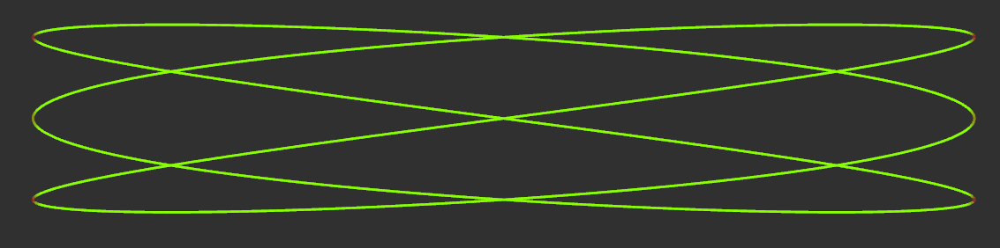
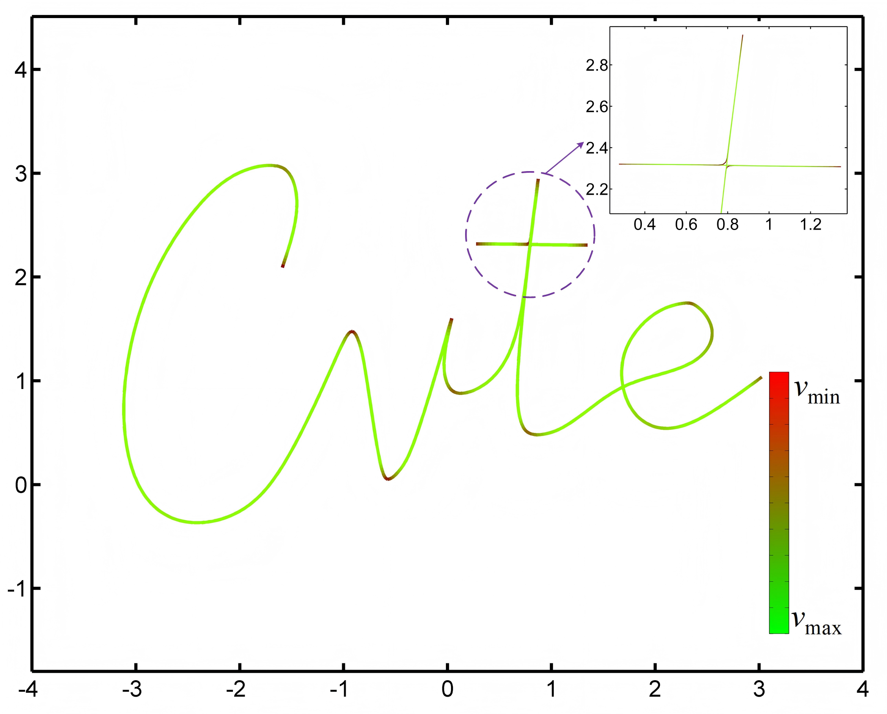
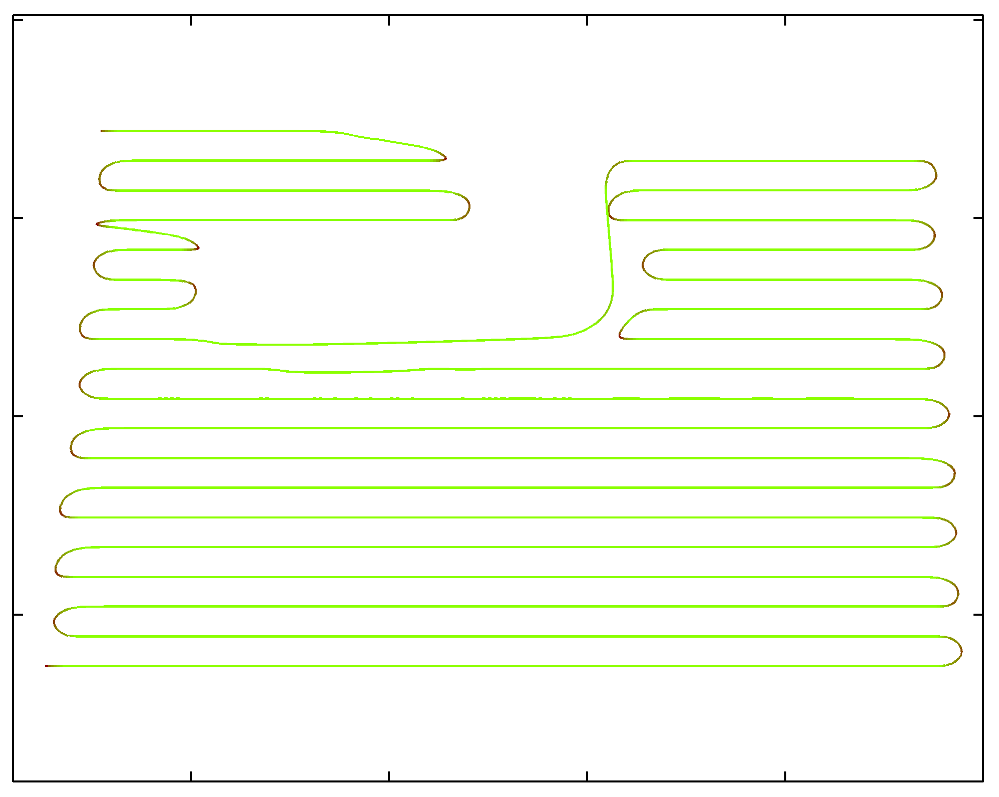

<h1 align="center">
  [IROS 2025
   
  ] TOPP-DWR
</h1>

<p align="center">
  
</p>

## Table of Contents

* [Introduction](#1-Introduction)
* [Prerequisites](#2-Prerequisites)
* [Installation](#3-Installation)
* [Usage](#4-Usage)
* [Configuration](#5-Configuration)
* [Acknowledgements](#6-Acknowledgements)
* [License](#7-License)
* [Notes](#8-Notes)

## 1. Introduction

TOPP-DWR is an open-source tool designed to perform **Time-Optimal Path Parameterization (TOPP)** for **Differential Driven Wheeled Robots (DWR)**. The core objective is to compute the minimum time required to traverse a predefined geometric path, while respecting constraints on:
*   Linear acceleration
*   Linear velocity
*   Angular velocity
*   Joint velocity

The algorithm efficiently solves the underlying optimization problem using **Second-Order Cone Programming (SOCP)** via the **MOSEK 10.2** solver. Additionally, the open-source solver **ECOS** also supports this SOCP-formulated optimization problem, providing an alternative implementation option for scenarios where open-source tools are preferred.

**Authors:**
*   [Yong Li](), [Yujun Huang]() and [Yi Chen]() from **Guangzhou Shiyuan Electronic Technology Co. Ltd. (CVTE)**
*   [Hui Cheng]() from **Sun Yat-sen University (SYSU)**

**Please cite our paper if you use this project in your research:**
*   **TOPP-DWR: Time-Optimal Path Parameterization of Differential-Driven Wheeled Robots Considering Piecewise-Constant Angular Velocity Constraints,**
    Yong Li, Yujun Huang, Yi Chen and Hui Cheng,
    *IEEE/RSJ International Conference on Intelligent Robots and Systems (IROS), 2025, Hangzhou, China.*
```
@inproceedings{IROS2025,
    Address = {Hangzhou, China},
    Author = {Yong Li, Yujun Huang, Yi Chen and Hui Cheng},
    Booktitle = {Proc. of the {IEEE/RSJ} Intl. Conf. on Intell. Robots and Syst. ({IROS})},
    Title = {TOPP-DWR: Time-Optimal Path Parameterization of Differential-Driven Wheeled Robots Considering Piecewise-Constant Angular Velocity Constraints},
    Month = Oct,
    Year = {2025}
}
```

If you find our research work useful or valuable for your own projects, we would greatly appreciate it if you could kindly give us a ⭐.


## 2. Prerequisites

*   **Operating System:** Ubuntu 20.04 LTS
*   **System Processor:** X86_64 or Arm_64
*   **ROS:** ROS2 Foxy
*   **Solver1:** MOSEK 10.2 (Academic License is free)
*   **Solver2:** Ecos (Open Source SOCP Solver)
*   **Libraries:** Eigen3


## 3. Installation

### 3.1. Clone the Repository

```bash
# Create a new ROS 2 workspace (if you don't have one)
mkdir -p ~/topp_dwr_ws/src

cd ~/topp_dwr_ws/src

# Clone the repository
git clone https://github.com/liyong2019/TOPP-DWR.git

# Navigate back to the workspace root
cd ..
```

### 3.2. Install MOSEK

* Obtain a License: Register for a free academic license from the [MOSEK website](https://www.mosek.com/products/academic-licenses/).

* Place the License File: After receiving the license file (`mosek.lic`), place the license at /mosek/10.2/:
```bash
# Move your license file to ${PROJECT_NAME}/mosek/10.2/mosek.lic
mv /path/to/your/mosek.lic ${PROJECT_NAME}/mosek/10.2/
```

### 3.3. Build the Package
```bash
# Source ROS 2 environment
source /opt/ros/foxy/setup.bash

# Build the workspace
colcon build

# Source the new setup files
source install/setup.bash
```

## 4. Usage
The core functionality is provided by the **topp_dwr_node**.
### 4.1. Basic Command

```bash
./install/topp_dwr/lib/topp_dwr/topp_dwr_node --algo [ALGORITHM] --traj [TRAJECTORY_TYPE]
```

### 4.2. Options
```bash
--algo [type] (Required): Select the optimization algorithm.
        mosek_c:   Use the MOSEK 10.2 C API.
        mosek_cpp: Use the MOSEK 10.2 C++ API.
        ecos:      Use the ECOS C++ API.
--traj [type] (Required): Select the trajectory source.
        c1: Use a standard Lissajous curve.
        c2: Use a complex CVTE curve (loaded from file).
        c3: Use a full-coverage path (loaded from file).
        c4: Interactive mode - Generate a path from RViz clicks.
```
### 4.3. Example Commands
#### 4.3.1. Run with a Predefined **Lissajous Curve** with **Mosek C API**
<p align="center">
  
</p>

```bash
# Run with a Predefined Lissajous Curve and MOSEK C API
./install/topp_dwr/lib/topp_dwr/topp_dwr_node --algo mosek_c --traj c1
```
#### 4.3.2. Run with a Complex **CVTE Curve** with **Mosek CPP API**
<p align="center">
  
</p>

```bash
# Run with a Complex "CVTE" Curve and MOSEK CPP API
./install/topp_dwr/lib/topp_dwr/topp_dwr_node --algo mosek_cpp --traj c2
```
#### 4.3.3. Run with a **Full Coverage Path** of a Cleaning Robot with **ECOS API**

<p align="center">
  
</p>

```bash
# Run with a Full Coverage Path and ECOS API
./install/topp_dwr/lib/topp_dwr/topp_dwr_node --algo ecos --traj c3
```

#### 4.3.4. Run in **Interactive RViz Mode**

<p align="center">
  
</p>

* Launch RViz: Open RViz and load a configuration that displays MarkerArray on the topic trajectory.

* Run the Node:
```bash
# Run with Waypoints from RVIZ and MOSEK C API
./install/topp_dwr/lib/topp_dwr/topp_dwr_node --algo mosek_c --traj c4

# Define Waypoints: Click "2D Pose Estimate" in RViz at least 5 times.
Trigger Generation: Click "2D Pose Estimate" in RViz to start optimization.

# Finish Define Waypoints: Click "2D Goal Pose" in RViz.
Trigger Generation: Click "2D Goal Pose" in RViz to start optimization.   

# Visualize: 
The optimized trajectory "/trajectory" will be displayed in RViz with color-coded velocity.
```

## 5. Configuration
Kinodynamic parameters (max velocity, acceleration, etc.) are loaded from configuration files within the package, based on the selected trajectory type (--traj). Default parameters are used if the config file is not found.
## 6. Acknowledgements

* We use the commercial MOSEK 10.2 library or open source solver ECOS for solving the SOCP problem.
* This is a research code, any fitness for a particular purpose is disclaimed.
* For the sake of code compactness and readability, certain complex implementations have been simplified relative to the original version used in our research. Despite these simplifications, the time of the generated trajectory differs by less than 1% from the results presented in Table I of the associated paper, ensuring consistency with the reported performance.

## 7. License
The source code is released under the GPLv3 license.

## 8. Notes

The code is under active development. If you encounter any bugs or have feature requests, please feel free to open an issue on GitHub.
    For any questions, you can also contact the primary author: liyong2018@zju.edu.cn.

